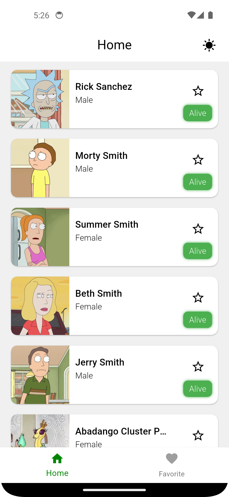
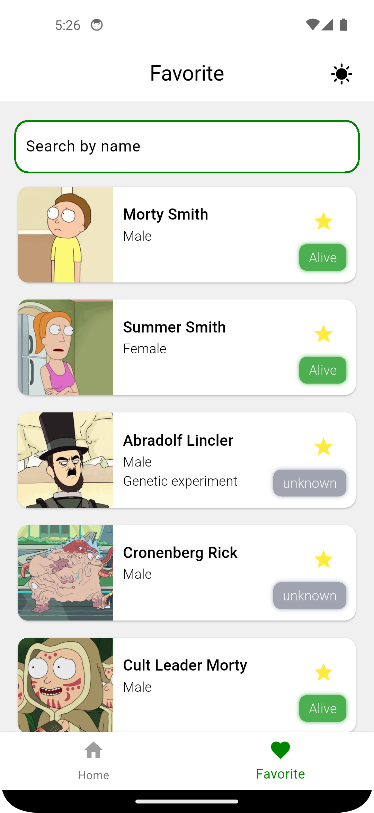
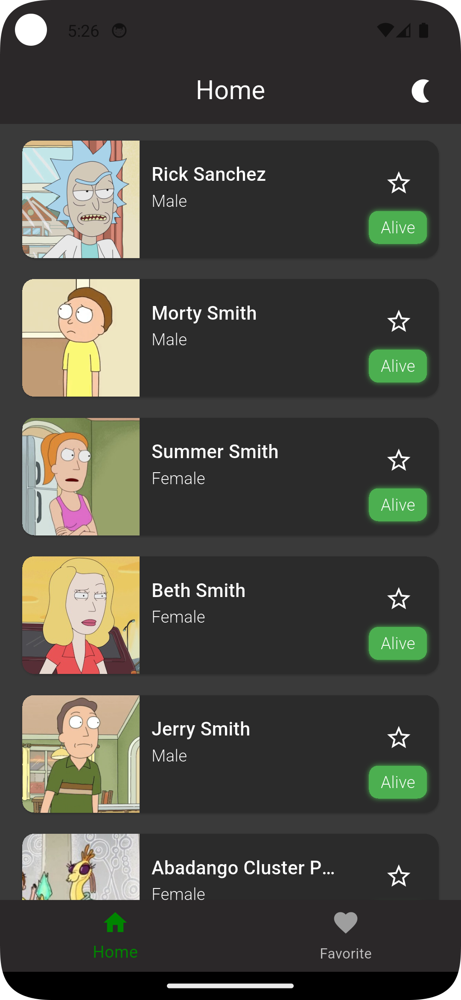
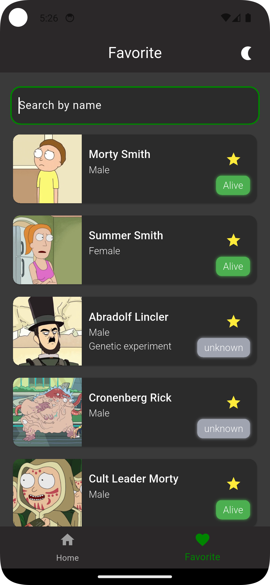

# Мобильное приложение "Список персонажей Рика и Морти"

## Описание

Данное мобильное приложение, разработанное на Flutter, предоставляет пользователю доступ к обширному списку персонажей из популярного мультсериала "Рик и Морти" посредством публичного API. Приложение обладает интуитивно понятным интерфейсом, позволяя просматривать информацию о персонажах, добавлять их в избранное и получать доступ к сохраненным данным даже в режиме оффлайн.

## Ссылка на API

Используется публичный API "Рик и Морти": [https://rickandmortyapi.com/documentation/](https://rickandmortyapi.com/documentation/)

## Функциональные возможности

1.  **Главный экран (Список персонажей)**
    
    * Каждая карточка содержит:
        * Изображение персонажа.
        * Имя персонажа.
        * Дополнительные характеристики (например, статус, вид, локация).
        * Кнопка "звездочка" для добавления/удаления персонажа из избранного (заполненная - в избранном, пустая - не в избранном).

2.  **Экран "Избранное"**
    
    * Отображение списка персонажей в формате карточек.
    * Отображение списка всех добавленных в избранное персонажей.
    * Карточки персонажей идентичны карточкам на главном экране.
    * Функциональность сортировки списка избранных персонажей (например, по имени).
    * Возможность удаления персонажа из списка избранных.

3.  **Навигация**
    * Удобная навигация между главным экраном и экраном "Избранное" с использованием нижнего навигационного бара (BottomNavigationBar).

4.  **Дополнительные возможности**
    * **Пагинация:** Автоматическая подгрузка новых персонажей на главном экране при прокрутке списка вниз, обеспечивая плавную загрузку большого количества данных.
    * **Кеширование:** Загруженные данные о персонажах сохраняются локально, что позволяет приложению работать и отображать ранее просмотренную информацию даже при отсутствии подключения к интернету.
    * **Сохранение избранного:** Информация о избранных персонажах надежно сохраняется в локальной базе данных (например, SQLite).

## Нефункциональные требования

* Использован современный подход к управлению состоянием (например, ChangeNotifier).
* Приложение построено с минимальным набором необходимых зависимостей для работы с базой данных и сетью.
* Для взаимодействия с API используются REST-запросы.
* Кодовая база отличается чистотой, высокой читаемостью и логичной структурой.

## Дополнительные плюсы (реализовано):

* Поддержка светлой и темной тем оформления с возможностью переключения между ними.
   

